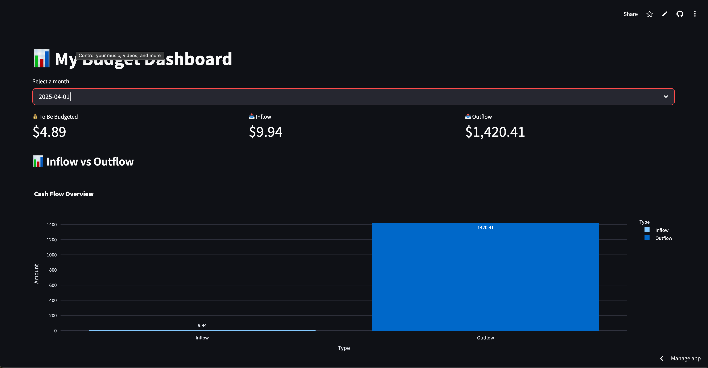
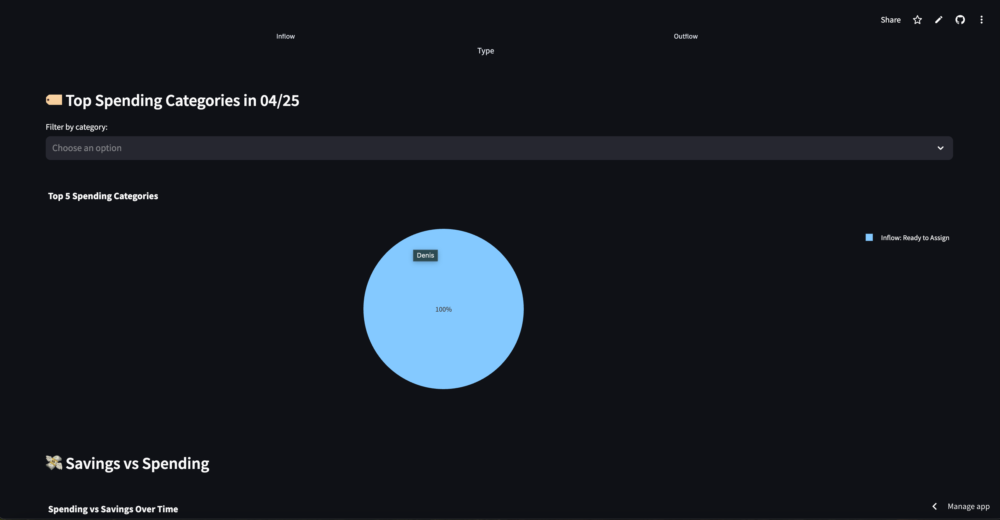
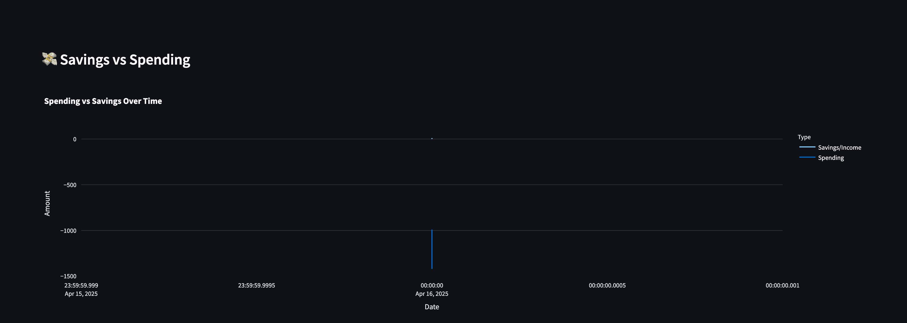
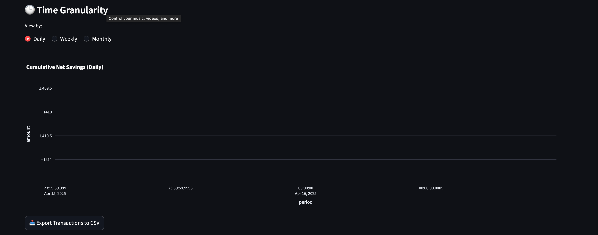

# 📊 YNAB Mobile Dashboard

A mobile-optimized interactive budget dashboard powered by the YNAB (You Need A Budget) API, built using Python, Streamlit, and Plotly. This dashboard helps visualize your financial health through real-time budget insights, category breakdowns, and savings vs spending trends.

---

## 🚀 Features

* 📆 **Month Selector** : Choose from available budget months
* 💰 **Summary Metrics** :
  * To Be Budgeted
  * Inflow & Outflow
* 📊 **Visualizations** :
  * Cash Flow Bar Chart
  * Top Spending Categories Pie Chart
  * Savings vs Spending Line Chart
  * Net Savings Over Time
  * Category Breakdown Over Time
  * Interactive Granularity View (Daily, Weekly, Monthly)
* 🔍 **Category Filters** for detailed analysis
* 📤 **Export to CSV** functionality for offline reporting

---

## 🧰 Tech Stack

* Streamlit
* Plotly Express
* YNAB API
* Python 3.12+

---

## 🔒 Setup Instructions

1. **Clone the Repo**

```bash
git clone https://github.com/yourusername/ynab-dashboard.git
cd ynab-dashboard
```

2. **Create Virtual Environment**

```bash
python -m venv env
source env/bin/activate  # or .\env\Scripts\activate on Windows
```

3. **Install Requirements**

```bash
pip install -r requirements.txt
```

4. **Set Up Environment Variables**
   Create a `.env` file with:

```dotenv
YNAB_TOKEN=your_ynab_personal_access_token_here
```

🔐 *If deploying to Streamlit Cloud, use the "Secrets" tab instead.*

5. **Run Locally**

```bash
streamlit run dashboard.py
```

---

## 📸 Screenshots & Visuals

### 📋 Dashboard Overview

🏷️ Category Pie Chart

💸 Savings vs Spending Trend

🗂️ Category Breakdown



---

## 🌐 Deployment of this Application

Deployed on [🌐 **Open the Live App**](https://denismoneyapp.streamlit.app/)

➡️ *Click the link to view it.* Set the main file to `dashboard.py` and configure `YNAB_TOKEN` in Secrets.

---

## 📬 Feedback & Contributions

Pull requests, suggestions, and feedback are welcome! Let's build smarter financial tools together.

---

## 🧠 Credits

Created with ❤️ by  **Denis Kalala** , powered by real-time insights from  **YNAB** .

---

## 📄 License

MIT License

---

### About

Time to change my habits 💡
